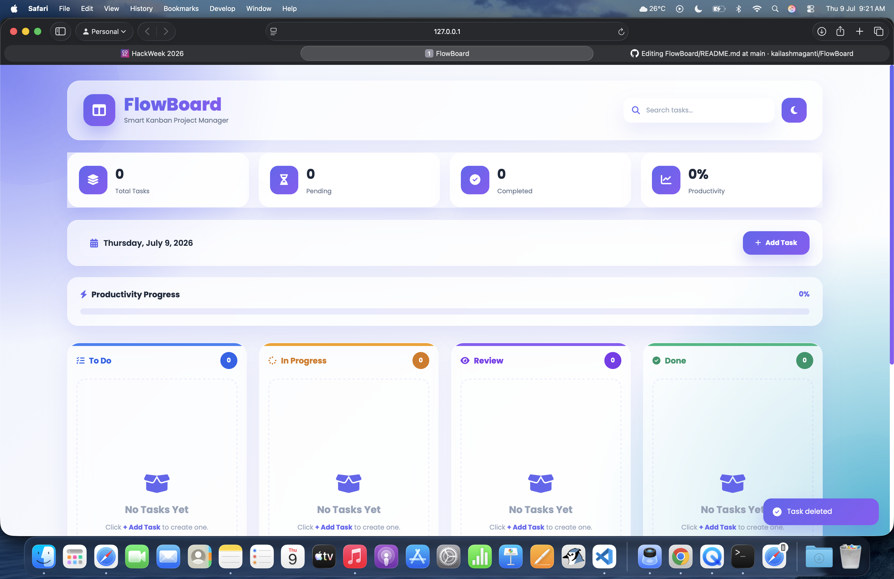
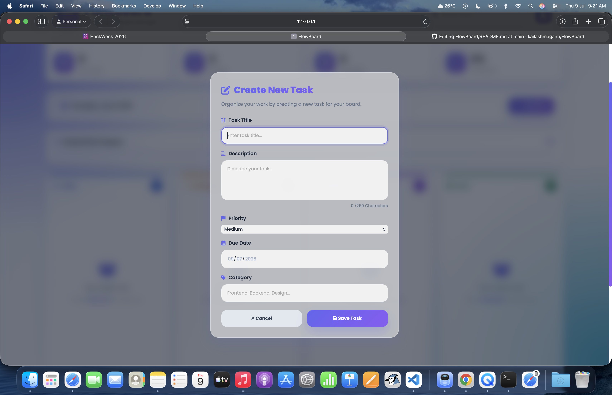
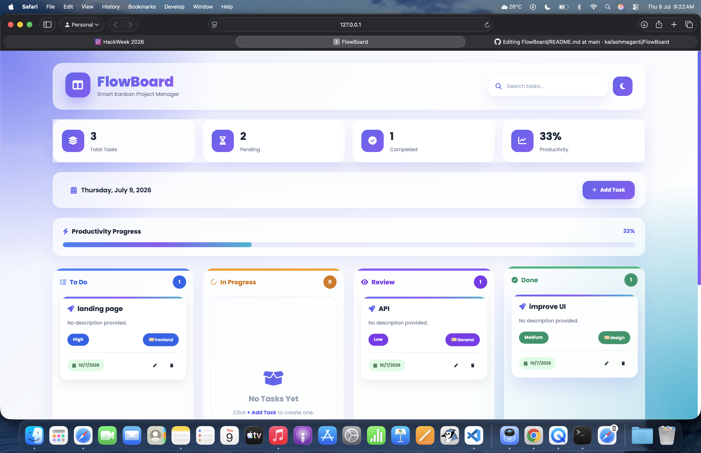

# 🚀 FlowBoard

FlowBoard is a modern Kanban Board web application that helps users organize tasks visually using drag-and-drop workflow management. It provides an intuitive interface for tracking progress, managing priorities, and improving productivity.

## 🌐 Live Demo

Add your GitHub Pages link here:

https://YOUR_USERNAME.github.io/FlowBoard/

---

## 📸 Screenshots

## Dashboard



## Add Task



## Task Board




---

## ✨ Features

- 📋 Four Kanban Columns
  - To Do
  - In Progress
  - Review
  - Done

- ➕ Add New Tasks

- ✏️ Edit Existing Tasks

- 🗑 Delete Tasks

- 🖱 Drag & Drop Support

- 🔍 Live Task Search

- 🌙 Dark / Light Theme

- 💾 Local Storage Persistence

- 📊 Dashboard Statistics

- 📈 Productivity Progress Bar

- 🏷 Priority Badges

- 📅 Due Date Tracking

- 📝 Category Labels

- 🔔 Toast Notifications

- 📱 Responsive Design

- ⌨️ Keyboard Shortcuts

---

## 🛠 Built With

- HTML5
- CSS3
- JavaScript (ES6)
- Local Storage API
- Font Awesome
- Google Fonts

---

## 🚀 Installation

Clone the repository:

```bash
git clone https://github.com/YOUR_USERNAME/FlowBoard.git
```

Open the project folder:

```bash
cd FlowBoard
```

Run by opening:

```
index.html
```

or use VS Code Live Server.

---

## 📂 Project Structure

```
FlowBoard/
│
├── index.html
├── style.css
├── script.js
├── README.md
└── screenshots/
```

---

## 🎯 Future Improvements

- User authentication
- Cloud database integration
- Team collaboration
- Task deadlines with reminders
- File attachments
- Calendar integration
- Analytics dashboard

---

## 👨‍💻 Author

**Kailash Maganti**

GitHub:
https://github.com/kailashmaganti

---

## 📄 License

This project is created for educational purposes as part of HackWeek Challenge #11.
